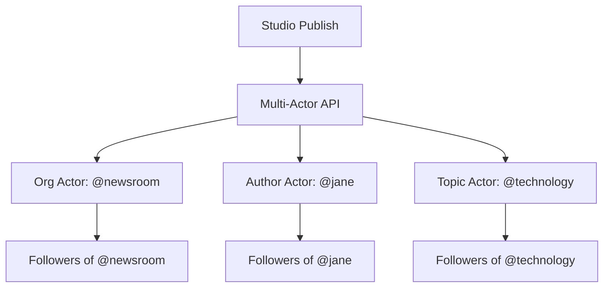

## Overview

The **pro-activitypub** plugin extends the Federation Gateway with enterprise-grade features for high-volume publishers. It adds multi-actor publishing, scheduled delivery, analytics dashboards, advanced content filtering, and external cross-posting.

<Callout kind="info">
  This plugin requires a running **Federation Gateway** and the **Pro license tier**. For base federation setup, see the [Studio CE federation guide](https://docs.roadbeat.net/guides/federation).
</Callout>

## Multi-Actor Publishing

Publish a single piece of content to **multiple AP outboxes** simultaneously — for example, the organization actor, the author actor, and a topic actor — all from a single API call.

<Callout kind="tip">
  This ensures maximum reach — users following the topic, the author, or the organization all receive the content without duplicate deliveries to overlapping followers.
</Callout>

## Scheduled Federation

Decouple ActivityPub delivery from the CMS publish timestamp. Schedule content to federate at a specific future date/time, or batch deliveries during optimal engagement windows.

**Use cases:**
- Schedule federation for 9:00 AM CET even though editors publish at midnight
- Delay federation until a coordinated press embargo lifts
- Batch multiple articles into a single delivery window

<Steps>
  <Step title="Create scheduled job" icon="clock">
    When publishing, select a future federation time via the API or set a `scheduledAt` field.
  </Step>
  <Step title="Job queued" icon="list">
    The job appears in the scheduled queue with status `pending`. It can be viewed, rescheduled, or cancelled.
  </Step>
  <Step title="Auto-execute" icon="play-circle">
    A cron job checks every minute for due jobs, executes them, and records delivery results.
  </Step>
</Steps>

## Federation Analytics

Real-time analytics on your federation performance:

<Columns cols={3}>
  <Card title="Delivery Stats" icon="bar-chart" href="#delivery-analytics">
    Per-host success rates, avg delivery attempts, failure analysis.
  </Card>
  <Card title="Follower Geo" icon="map" href="#follower-geo">
    Geographic distribution of followers by TLD/region.
  </Card>
  <Card title="Boost Lineage" icon="share-2" href="#boost-lineage">
    Who boosted what, per-host spread, top-boosted content.
  </Card>
</Columns>

### Delivery Analytics

View overall and per-host delivery metrics for any time period:

| Metric | Description |
|--------|-------------|
| Total delivered | Activities successfully delivered |
| Total failed | Permanent delivery failures |
| Total pending | Activities awaiting delivery |
| Per-host success rate | Delivery success % per remote server |
| Avg attempt count | Mean retries before success/failure |

### Follower Geo

Understand where your Fediverse audience is located:

- Followers grouped by host TLD (`.de`, `.fr`, `.social`, `.org`)
- TLDs mapped to ISO country/region codes (40+ ccTLDs supported)
- Per-region percentage breakdown
- Filter by actor for multi-actor publishers

### Boost Lineage

Track how your content spreads across the Fediverse:

- **Top-K boosted objects** with full boost node list
- Each boost node: actor IRI, handle, timestamp
- **Unique host count** per object (spread metric)
- Per-host boost distribution

## Advanced Content Filters

Automatically moderate inbound ActivityPub content with configurable filter rules:

| Condition Type | Description |
|----------------|-------------|
| `regex` | Content matches a regular expression |
| `keyword` | Exact keyword match (case-insensitive) |
| `keyword_glob` | Wildcard keyword matching (`*spam*`) |
| `domain` | Actor's host matches a domain |
| `actor_pattern` | Actor IRI matches a regex pattern |
| `language` | Content language matches (ISO 639-1) |
| `ai_toxicity` | AI toxicity score exceeds threshold (future) |

**Actions:** `reject` (silent drop), `quarantine` (hold for review), `flag` (create moderation event), `log` (audit only)

<Callout kind="tip">
  Use the **test endpoint** (`POST /admin/pro/activitypub/filters/test`) to dry-run a filter rule against sample activities before enabling it.
</Callout>

## External Cross-Posting

Import content from external Mastodon RSS feeds or ActivityPub outboxes into Studio as drafts:

<Steps>
  <Step title="Configure a source" icon="rss">
    Add an RSS feed URL (e.g. `https://mastodon.social/@user.rss`) or an AP outbox URL. Set the poll interval and target Studio organization.
  </Step>
  <Step title="Auto-poll" icon="refresh-cw">
    The system polls sources at configured intervals (default: 60 min). New items are deduplicated and stored as drafts.
  </Step>
  <Step title="Review drafts" icon="eye">
    Browse imported drafts in the admin UI. Each draft shows title, content, author, tags, and media.
  </Step>
  <Step title="Approve or reject" icon="check">
    Approve drafts to move them to the Studio content pipeline, or reject to discard.
  </Step>
</Steps>

**Supported source types:**
- **RSS/Atom feeds** — standard RSS 2.0, Atom 1.0, Mastodon `.rss` feeds
- **AP outbox collections** — OrderedCollection/OrderedCollectionPage pagination

## Admin API

All Pro endpoints are under `/admin/pro/activitypub` and require admin token authentication.

| Method | Path | Description |
|--------|------|-------------|
| `POST` | `/publish/multi-actor` | Multi-actor publish |
| `POST` | `/scheduled` | Create scheduled job |
| `GET` | `/scheduled` | List scheduled jobs |
| `POST` | `/scheduled/:id/cancel` | Cancel a job |
| `POST` | `/scheduled/:id/reschedule` | Reschedule a job |
| `GET` | `/analytics/delivery` | Delivery analytics |
| `GET` | `/analytics/followers/geo` | Follower geo distribution |
| `GET` | `/analytics/boosts` | Boost lineage analytics |
| `GET` | `/filters` | List content filter rules |
| `POST` | `/filters` | Create a filter rule |
| `PUT` | `/filters/:id` | Update a filter rule |
| `DELETE` | `/filters/:id` | Delete a filter rule |
| `GET` | `/filters/stats` | Filter hit statistics |
| `POST` | `/filters/test` | Test filter against sample |
| `GET` | `/crosspost/sources` | List cross-post sources |
| `POST` | `/crosspost/sources` | Add a source |
| `PUT` | `/crosspost/sources/:id` | Update source config |
| `DELETE` | `/crosspost/sources/:id` | Remove a source |
| `POST` | `/crosspost/sources/:id/poll` | Manual poll trigger |
| `GET` | `/crosspost/drafts` | List imported drafts |
| `POST` | `/crosspost/drafts/:id/approve` | Approve a draft |
| `POST` | `/crosspost/drafts/:id/reject` | Reject a draft |
| `GET` | `/crosspost/stats` | Cross-post statistics |
