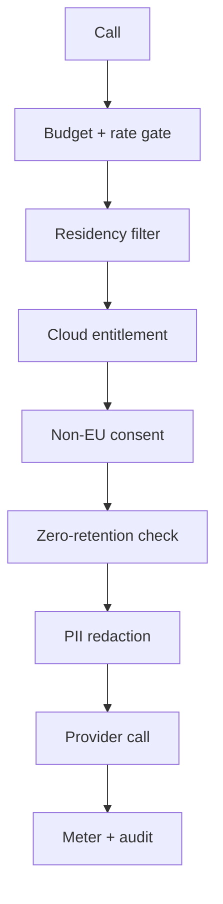

## Overview

The AI Provider Gateway applies a full governance pipeline to **every** call, regardless of which feature triggered it. This page covers the privacy and cost controls: residency, consent, zero-retention, redaction, budgets, usage, and audit.

<Callout kind="info">
  These controls are part of `pro-ai` (**Team** tier). A subset — custom redaction rules, zero-retention overrides, and raw-log retention controls — is **advanced governance** and requires the **Business** tier (`ai_advanced_governance`).
</Callout>

The order of enforcement before any token leaves your instance:

## Data Residency

Every provider declares a residency: **self-hosted**, **EU**, or **non-EU**. Each call resolves an effective residency mode — a per-call override → the task route → the instance default (`AI_RESIDENCY_MODE`, default `eu_only`) — and only providers that satisfy it are eligible.

| Mode | Allowed providers |
|---|---|
| `local_only` | Self-hosted only |
| `eu_only` | Self-hosted + EU cloud |
| `any` | All providers (non-EU still needs consent + entitlement) |

<Callout kind="tip">
  Keep `eu_only` as the instance default for GDPR-aligned operation. Route only the tasks that genuinely need a non-EU model to `any`, and only after recording consent.
</Callout>

## Cloud Provider Consent

A **non-EU** provider can only be used once the organization has recorded explicit, logged consent for that provider type. Routing enforces this automatically: EU and self-hosted providers always pass; non-EU providers without consent are blocked, and if they are the *only* eligible candidates the call is refused so the UI can prompt for consent.

<Steps>
  <Step title="Open the Consent tab" icon="shield">
    Go to **AI → Consent** in the sidebar.
  </Step>
  <Step title="Grant consent for a provider type" icon="check">
    Record consent for a specific non-EU provider type (e.g. `openai`, `anthropic`, `gemini`). The grant is logged with the granting user and an optional note.
  </Step>
  <Step title="Revoke at any time" icon="x">
    Revoking consent immediately removes that provider type from routing.
  </Step>
</Steps>

<Callout kind="info">
  Using a non-EU provider also requires the **Business** entitlement `ai_cloud_providers_enabled`. Consent is the organization's opt-in; the entitlement is the license tier.
</Callout>

## Enforced Zero-Retention

In `eu_only` mode, a **cloud** (non-self-hosted) provider may only be used if it advertises a zero-retention endpoint (`no_retention = true`) **or** the organization has recorded an explicit override. This prevents content silently flowing to a retaining endpoint under an EU-only policy.

- Mark a provider's endpoint as **no-retention** when the vendor contractually guarantees zero data retention.
- If you must use a retaining cloud provider under `eu_only`, an admin can acknowledge a **zero-retention override** for that provider type.

<Callout kind="alert">
  Acknowledging a zero-retention override is **advanced governance** (Business). It is an explicit, logged decision to send content to a retaining endpoint under an EU-only policy.
</Callout>

## PII Redaction

Before any **cloud** call, outgoing text is run through the organization's redaction rules. With no rules configured, a built-in default strips common PII (emails, phone numbers, IBANs) on cloud routes only; `seed-defaults` materializes it for editing.

A redaction rule defines:

| Field | Description |
|---|---|
| `appliesTo` | `cloud` (only on cloud egress) or `all` (every route) |
| `patterns` | Regex strings matched against outgoing text |
| `fieldPaths` | Dot-paths stripped from structured content payloads |
| `enabled` | Toggle without deleting |

<Callout kind="info">
  The **built-in default** redaction and its `seed-defaults` materialization are available on **Team**. Creating **custom** redaction rules is advanced governance (**Business**).
</Callout>

Redacted calls are flagged in the usage log so you can audit exactly when redaction fired.

## Budgets & Rate Limits

Budgets stop runaway spend before a call is made. The pre-call gate enforces, in order:

1. **Per-user rate limit** — default 60 requests/minute/user (`AI_USER_RATE_LIMIT`)
2. **Admin budgets** — org-shared and per-user token/cost budgets, per `day` or `month`, with a configurable alert threshold
3. **License ceilings** — hard `max_ai_tokens_per_day` and `max_ai_cost_per_month` caps from the license tier

A breach returns HTTP **429**; alerts are emitted (and throttled) to admins as a budget approaches and when it blocks.

<Steps>
  <Step title="Open the Usage tab" icon="bar-chart">
    Go to **AI → Usage** and scroll to **Budgets**.
  </Step>
  <Step title="Add a budget" icon="plus">
    Choose a period (day/month), an optional token limit and cost limit (€), an alert percentage, and an optional user (blank = org-wide).
  </Step>
  <Step title="Watch the burn-down" icon="activity">
    Each budget shows a live burn-down bar that turns amber at the alert threshold and red when exhausted.
  </Step>
</Steps>

<Callout kind="tip">
  License ceilings are a safety net layered **on top of** your admin budgets — set them via the license; configure day-to-day limits as budgets. When no ceiling is set, the gate skips the extra check entirely.
</Callout>

## Usage & Cost Dashboard

The **Usage** tab summarizes AI consumption over a selectable range (7 / 30 / 90 days):

- **Summary cards** — requests, tokens, cost, redactions, fallbacks, failures
- **Tokens per day** — a sparkline of daily token volume
- **By caller** and **By model** — where tokens and cost are going

Metering never blocks inference: usage is recorded after the fact, and a failure to write a usage row is logged but never surfaced to the caller.

## Audit Log & Raw-Text Retention

Every call is written to an append-only audit log. By default the log stores **privacy-preserving hashes** of the prompt and output — never the raw text. For debugging, an admin can open a **time-boxed raw-text retention window** during which raw prompt/output is retained for a fixed number of hours, then automatically dropped.

| Endpoint | Description |
|---|---|
| `GET /api/v1/pro/ai/audit` | Query the audit log (metadata + hashes) |
| `GET /api/v1/pro/ai/audit/export` | GDPR export (optionally for one user) |
| `GET /api/v1/pro/ai/audit/settings` | Read the raw-text retention window status |
| `PUT /api/v1/pro/ai/audit/settings` | Open/close the raw-text retention window |

<Callout kind="alert">
  Opening the raw-text retention window is **advanced governance** (Business). The read-only status (`GET /settings`) and the hashed audit query remain available on Team.
</Callout>

## Advanced Governance (Business)

Three controls require the **Business** tier (`ai_advanced_governance`). Each is a deliberate, logged escalation beyond the safe defaults:

<Columns cols={3}>
  <Card title="Custom redaction" icon="eraser">
    Author org-specific redaction rules beyond the built-in PII default.
  </Card>
  <Card title="Zero-retention override" icon="shield-off">
    Acknowledge use of a retaining cloud provider under <code>eu_only</code>.
  </Card>
  <Card title="Raw-log retention" icon="history">
    Open the time-boxed raw prompt/output retention window.
  </Card>
</Columns>

When the entitlement is absent, these endpoints return HTTP **403**; everything else in this page stays available on Team.

## API Reference

| Endpoint | Description |
|---|---|
| `GET /api/v1/pro/ai/usage` | Usage dashboard (tokens/cost by caller/model/day) |
| `GET /api/v1/pro/ai/budgets` | List org + per-user budgets (burn-down) |
| `PUT /api/v1/pro/ai/budgets` | Create or update a budget |
| `DELETE /api/v1/pro/ai/budgets/:id` | Delete a budget |
| `GET /api/v1/pro/ai/redaction` | List redaction rules |
| `POST /api/v1/pro/ai/redaction/seed-defaults` | Materialize the default redaction rule |
| `POST /api/v1/pro/ai/redaction` | Create a custom redaction rule _(Business)_ |
| `DELETE /api/v1/pro/ai/redaction/:id` | Delete a redaction rule |
| `GET /api/v1/pro/ai/consents` | List consent records |
| `POST /api/v1/pro/ai/consents` | Grant consent for a non-EU provider type |
| `DELETE /api/v1/pro/ai/consents/:providerType` | Revoke consent |
| `POST /api/v1/pro/ai/consents/retention-overrides` | Acknowledge a zero-retention override _(Business)_ |
| `GET /api/v1/pro/ai/audit` | Query the audit log |
| `PUT /api/v1/pro/ai/audit/settings` | Open/close the raw-text retention window _(Business)_ |

For providers, routing, capabilities, and the consumer contract, see the [AI Provider Gateway](/plugins/ai).
