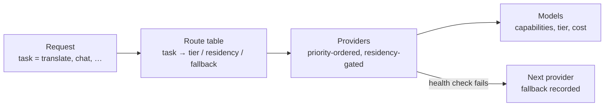

## Overview

These recipes take you from a fresh `pro-ai` installation to a working, governed provider configuration. Everything here is applied in **Settings → AI** (`/pro/ai`) or via the [admin API](/plugins/ai#api-reference); API keys entered in the UI are stored in the encrypted credential vault (AES-256-GCM, per-organization data key) and are **never returned** — the UI only ever shows a masked hint.

<Callout kind="tip">
  **Recommended posture:** a local Augmentor as the preferred provider (priority `1`) with Mistral (EU) as the cloud fallback (priority `2`). Content then runs on your own hardware by default and never leaves the EU even when the local provider is down — the egress-posture card on the providers tab confirms this at a glance.
</Callout>

### Prerequisites

- Studio with the `pro-ai` plugin installed and licensed (Team tier or above)
- An admin account (provider and routing changes require admin permissions)
- `PRO_AI_VAULT_KEK` set to a random 32-byte base64 key in production — without it the vault falls back to an **insecure development key** and logs a loud warning
- For the semantic index (optional): the [pgvector](https://github.com/pgvector/pgvector) extension installed on your PostgreSQL server

## How the pieces fit

Three layers decide which model answers a request:



- **Providers** are endpoints (your Augmentor, Mistral, Azure, …) with a residency (`self_hosted`, `eu`, `non_eu`) and a priority — lower is preferred.
- **Models** are registered per provider with their capabilities (`chat`, `tools`, `embed`, `vision`, `transcribe`), a tier (`cheap`/`heavy`), and optional per-1k-token costs that drive metering and budgets.
- **Routes** map tasks to tiers/residencies/fallback chains (see [Recipe 5](#recipe-5--task-routing)); unset routes fall back to sensible instance defaults.

Before any call runs, the [governance gates](/plugins/ai-governance) apply: residency mode, non-EU consent, zero-retention policy, PII redaction, and budgets. Every call is metered with the model the provider **actually served**, so pinned model versions stay auditable.

## Recipe 1 — Local Augmentor / Ollama (EU-sovereign default)

The Augmentor is roadbeat's on-prem AI service (vLLM/Ollama serving Mistral models, OpenAI-compatible on port `3800`). A plain Ollama works identically — only the base URL differs.

<Steps>
  <Step title="Verify the endpoint answers">
    <Tabs>
      <Tab title="Augmentor" icon="server">
        ```bash
        curl http://your-augmentor-host:3800/v1/models
        ```
      </Tab>
      <Tab title="Plain Ollama" icon="terminal">
        ```bash
        curl http://localhost:11434/v1/models
        # Pull models first if the list is empty:
        ollama pull mistral-small3.2 && ollama pull multilingual-e5-large
        ```
      </Tab>
    </Tabs>
    You should get a JSON model list. This same `/models` endpoint is what the gateway's health checks probe.
  </Step>
  <Step title="Add the provider">
    In **Settings → AI → Providers**, click **Add**:

    | Field | Value | Notes |
    |---|---|---|
    | Type | `augmentor` (or `ollama`) | Both speak the OpenAI wire format |
    | Name | `Local Augmentor` | Display name; unique per scope |
    | Base URL | `http://your-augmentor-host:3800/v1` | Include the `/v1` path |
    | API key | *(empty)* | Local endpoints need none |
    | Residency | `self_hosted` | Marks it "Local — no egress" |
    | Priority | `1` | Lower = preferred |

    Or via the API:

    ```bash
    curl -X POST https://studio.example.com/api/v1/pro/ai/providers \
      -H "Authorization: Bearer $ADMIN_JWT" -H "Content-Type: application/json" \
      -d '{
        "type": "augmentor",
        "name": "Local Augmentor",
        "baseUrl": "http://your-augmentor-host:3800/v1",
        "residency": "self_hosted",
        "priority": 1
      }'
    ```
  </Step>
  <Step title="Register its models">
    Add the models the endpoint actually serves, with their capabilities and tier:

    | Model id | Capabilities | Tier | Used for |
    |---|---|---|---|
    | `mistral-small3.2` | `chat`, `tools` | `cheap` | Translation, writing assist, classify, moderation |
    | `mistral-large` *(if served)* | `chat`, `tools` | `heavy` | Structured generation, agent planning |
    | `multilingual-e5-large` | `embed` | `cheap` | Semantic index (1024 dimensions — the pinned space) |

    Setting **cost per 1k tokens** is optional for local models, but useful: metered cost then reflects your internal accounting and feeds budgets and the usage dashboard.
  </Step>
  <Step title="Test and verify">
    Click **Test** on the provider row — you should see an **online** badge with latency. Then open any content item in the editor and run a quick action: the result card must carry the **Local — no egress** provenance badge.
  </Step>
</Steps>

<Callout kind="info">
  Running Studio in Docker with a host-local Ollama? Use `http://host.docker.internal:11434/v1` as the base URL so the container can reach the host.
</Callout>

## Recipe 2 — Mistral (EU cloud fallback)

<Steps>
  <Step title="Create an API key">
    Create a key in the [Mistral console](https://console.mistral.ai/). Mistral is EU-headquartered (Paris) and is the preferred cloud fallback for EU-sovereign setups.
  </Step>
  <Step title="Add the provider">
    | Field | Value | Notes |
    |---|---|---|
    | Type | `mistral` | |
    | Name | `Mistral (EU)` | |
    | Base URL | *(empty)* | Defaults to `https://api.mistral.ai/v1` |
    | API key | your key | Vaulted on save; never shown again |
    | Residency | `eu` | |
    | No retention | enable **only** if your Mistral plan guarantees zero data retention | Required in `eu_only` mode unless an admin records an override |
    | Priority | `2` | Fallback after the local provider |
  </Step>
  <Step title="Register models — pin versions">
    Register e.g. `chat`/`tools` and `embed` models. **Prefer pinned version ids** over rolling aliases:

    | Prefer | Over | Why |
    |---|---|---|
    | `mistral-small-2409` | `mistral-small-latest` | Reproducibility: audit rows and provenance always record the model the provider *served* — with a rolling alias, yesterday's result may come from a different model than today's |

    Set the per-1k costs from your Mistral pricing so budgets and the cost dashboard are accurate.
  </Step>
  <Step title="Verify the fallback path">
    Stop the local provider (or click **Test** while it's down) and run an editor quick action: the result should carry an **EU cloud** provenance badge with a fallback marker (↷), and `ai_fallbacks_total{from="augmentor",to="mistral"}` increments on `/metrics`.
  </Step>
</Steps>

<Callout kind="alert">
  In `eu_only` residency mode, a cloud provider **without** the *No retention* flag is blocked unless an admin records an explicit, logged override — see [Enforced Zero-Retention](/plugins/ai-governance#enforced-zero-retention).
</Callout>

## Recipe 3 — Azure OpenAI (EU region)

For organizations that need GPT-family models with EU data residency.

<Steps>
  <Step title="Deploy a model in an EU region">
    In the Azure portal, create an **Azure OpenAI** resource in an EU region (e.g. `swedencentral`, `francecentral`, `germanywestcentral`) and create a model deployment. The **deployment name** — not the underlying model name — acts as the model id in Studio.
  </Step>
  <Step title="Add the provider">
    | Field | Value |
    |---|---|
    | Type | `azure-openai` |
    | Name | `Azure OpenAI (EU)` |
    | Base URL | `https://your-resource.openai.azure.com` |
    | API key | your Azure key *(vaulted)* |
    | Residency | `eu` |
  </Step>
  <Step title="Register the deployment as a model">
    Add a model whose id **equals your deployment name** (e.g. `gpt-4o-eu`). The gateway automatically speaks Azure's per-deployment routes (`/openai/deployments/{name}/…?api-version=…`) and sends the `api-key` header instead of a Bearer token — no extra configuration needed.
  </Step>
  <Step title="Route selectively (optional)">
    Azure vision/transcription capabilities can serve just those tasks while chat stays local — see [Recipe 5](#recipe-5--task-routing) for a per-task provider override.
  </Step>
</Steps>

<Callout kind="info">
  **Non-EU providers** (OpenAI, Anthropic Claude, Google Gemini) follow the same steps with residency `non_eu` — but two extra gates apply: the Business `ai_cloud_providers_enabled` entitlement, and an explicit, logged **org consent** before first use. Editors hit an inline consent dialog; admins can pre-grant via `POST /api/v1/pro/ai/consents` with `{ "providerType": "openai" }`. See [Cloud Provider Consent](/plugins/ai-governance#cloud-provider-consent).
</Callout>

## Recipe 4 — Per-user BYO keys

Any user can bring their own key for a provider type instead of using the org-shared one — useful for personal API quotas or trials.

<Steps>
  <Step title="Add a user-scoped provider">
    On **Settings → AI → Providers**, choose scope **User** when adding the provider (API: `"scope": "user"`). The key is attributed to that user but still encrypted under the organization's vault key and bound to the org's tenant boundary.
  </Step>
  <Step title="Understand the resolution order">
    At call time, a caller's **own** provider wins over the org-shared one for the same provider type. Usage, cost, and budgets are attributed to the owning scope — a per-user budget can cap a BYO key independently of the org budget.
  </Step>
</Steps>

## Recipe 5 — Task routing

The per-organization **route table** (Settings → AI → Routes, or `GET/PUT /api/v1/pro/ai/routes`) maps tasks to tiers, residencies, models, and fallback chains. A practical EU-first configuration:

```json
{
  "translate":          { "tier": "cheap", "residency": "eu_only", "fallback": ["mistral"] },
  "writeAssist":        { "tier": "cheap" },
  "generateStructured": { "tier": "heavy" },
  "embed":              { "model": "multilingual-e5-large" },
  "vision":             { "provider": "azure-openai" },
  "moderate":           { "threshold": 0.5, "enforcement": "advisory" },
  "dedup":              { "threshold": 0.9 }
}
```

What each knob does:

| Knob | Effect |
|---|---|
| `tier` | Picks a registered model of that tier (`cheap` for bulk work, `heavy` for reasoning) |
| `residency` | Narrows the residency mode **for this task only** (`local_only` \| `eu_only` \| `any`) |
| `model` | Pins an exact model id (use versioned ids for reproducibility) |
| `provider` | Forces a provider type for the task (e.g. vision → Azure) |
| `fallback` | Ordered provider-type chain tried when the preferred provider is unhealthy; entries may pin a model: `"mistral/mistral-small-2409"` |

Two entries configure the intelligence features rather than routing:

- **`moderate`** — `threshold` (score at which "review recommended" triggers, default `0.5`) and `enforcement` (`advisory` \| `soft_block` \| `hard_block`; the publish flow enforces it — the gateway itself never blocks). Setting a `residency` here *opts out* of the default: moderation, facet tagging, and teaser drafting are otherwise **pinned to local providers** so flagged content never leaves the instance.
- **`dedup`** — `threshold` is the cosine-similarity floor for duplicate candidates (default `0.9`, conservative/high-precision; near-verbatim copies are flagged even below it).

## Recipe 6 — The semantic index (pgvector)

Semantic search, "more like this", and duplicate detection need the embedding index. One-time setup:

<Steps>
  <Step title="Install pgvector">
    Install the extension binaries on your PostgreSQL server, then enable it for the Studio database (the plugin migration also attempts this):
    ```sql
    CREATE EXTENSION IF NOT EXISTS vector;
    ```
  </Step>
  <Step title="Apply migration 006">
    Run the plugin's `migrations/006_create_embeddings.sql` against the Studio database. It creates `pro_ai_embeddings` with an HNSW cosine index on `vector(1024)` — sized for the default embedding model.
  </Step>
  <Step title="Backfill existing content">
    New and edited content is indexed automatically (with a content-hash check, so unchanged saves cost nothing). Index the back catalog once with a batch job:
    ```bash
    curl -X POST https://studio.example.com/api/v1/pro/ai/jobs \
      -H "Authorization: Bearer $ADMIN_JWT" -H "Content-Type: application/json" \
      -d '{ "task": "embed", "input": { "backfill": true } }'
    ```
    Poll `GET /api/v1/pro/ai/jobs/{id}` — the result reports `{ indexed, skipped, total }`.
  </Step>
  <Step title="Verify">
    ```bash
    curl "https://studio.example.com/api/v1/pro/ai/search?query=climate%20policy&k=5" \
      -H "Authorization: Bearer $JWT"
    ```
    Hits come back ranked by cosine similarity, org-scoped, with the query embedding's provenance.
  </Step>
</Steps>

<Callout kind="alert">
  **The index is pinned to one vector space** — `AI_MODEL_EMBED` × `AI_EMBED_DIMENSIONS` (default `multilingual-e5-large` × `1024`). Writes from any other model or dimensionality are rejected, so spaces can never silently mix. Switching embedding models is a deliberate re-index: update the envs, `ALTER` the column's dimension (see the notes in migration 006), rebuild the HNSW index, then run a backfill job with `"force": true`.
</Callout>

## Environment reference

Instance-level defaults (per-org route/provider settings override them where noted):

| Variable | Default | Purpose |
|---|---|---|
| `AI_RESIDENCY_MODE` | `eu_only` | Instance default residency: `local_only` \| `eu_only` \| `any` |
| `AI_DEFAULT_LOCAL` | `augmentor` | Preferred local provider type |
| `AI_DEFAULT_CLOUD` | `mistral` | Preferred cloud fallback type |
| `AI_MODEL_CHEAP` / `AI_MODEL_HEAVY` | — | Fallback model ids per tier when no registered model matches |
| `AI_MODEL_EMBED` | `multilingual-e5-large` | Pinned embedding model (vector-space pin) |
| `AI_EMBED_DIMENSIONS` | `1024` | Pinned embedding dimensionality (must match the column typmod) |
| `AI_EMBED_INDEXING` | `on` | `off` disables automatic indexing on content saves (backfill job still works) |
| `AI_DEDUP_THRESHOLD` | `0.9` | Instance default duplicate-similarity floor |
| `AI_MODERATION_THRESHOLD` | `0.5` | Instance default "review recommended" score |
| `AI_USER_RATE_LIMIT` | `60` | Requests per minute per user |
| `AI_CALLER_WINDOW_TOKENS` | `100000` | Hard token ceiling per window for automation callers (agent/flows/jobs) — runaway-loop protection |
| `AI_VELOCITY_WINDOW_SEC` | `300` | Rolling window for the spend-velocity monitor |
| `AI_VELOCITY_FACTOR` | `4` | Org spend anomaly: current window vs rolling baseline multiplier |
| `AI_VELOCITY_MIN_TOKENS` | `20000` | Anomaly floor (near-idle orgs never alert) |
| `AI_VELOCITY_ENFORCE` | `alert` | `hard` upgrades org-wide anomalies from an admin alert to a 429 block |
| `PRO_AI_VAULT_KEK` | *(dev fallback)* | **Set in production**: random 32-byte base64 key encrypting the credential vault |

## Checking your egress posture

The providers tab opens with the **egress posture card**: the effective residency mode, whether any non-EU egress is structurally possible, and per provider whether routing can ever reach it (blocked by residency / needs consent / reachable). Any authenticated org member can read it — sovereignty transparency is for editors too, not only admins:

```bash
curl https://studio.example.com/api/v1/pro/ai/egress-posture \
  -H "Authorization: Bearer $JWT"
```

```json
{
  "residencyMode": "eu_only",
  "noNonEuEgress": true,
  "providers": [
    { "type": "augmentor", "name": "Local Augmentor", "residency": "self_hosted",
      "allowedByResidency": true, "reachable": true, "noRetention": false },
    { "type": "mistral", "name": "Mistral (EU)", "residency": "eu",
      "allowedByResidency": true, "reachable": true, "noRetention": true }
  ]
}
```

## Monitoring

`pro-ai` exports its metrics through Studio's `/metrics` endpoint (Prometheus text format, token-guarded — same scrape target your ops stack already uses). Labels are instance-level (task/provider/model/result); organization ids are deliberately never used as labels.

| Metric | Labels | Meaning |
|---|---|---|
| `ai_requests_total` | `task`, `provider`, `result` | Gateway requests (success/error) |
| `ai_tokens_total` | `direction`, `model` | Tokens in/out per model |
| `ai_cost_total` | `provider` | Metered cost (EUR) |
| `ai_latency_seconds_sum` / `_count` | `provider`, `task` | Latency summary — `rate(sum)/rate(count)` = mean |
| `ai_fallbacks_total` | `from`, `to` | Provider fallbacks (preferred → served) |
| `ai_budget_blocks_total` | `reason` | 429s: `budget`, `rate_limit`, `license`, `velocity_ceiling`, `velocity_anomaly` |
| `ai_redactions_total` | `task` | Calls where PII redaction modified the payload |

Alerts worth starting with:

```yaml
# The preferred (local) provider is being skipped — check its health.
- alert: AiProviderFallingBack
  expr: rate(ai_fallbacks_total[10m]) > 0

# A runaway automation loop was stopped by the velocity ceiling.
- alert: AiVelocityCeilingHit
  expr: increase(ai_budget_blocks_total{reason="velocity_ceiling"}[15m]) > 0

# Error rate on the gateway.
- alert: AiErrorRate
  expr: rate(ai_requests_total{result="error"}[10m]) / rate(ai_requests_total[10m]) > 0.05
```

Circuit-breaker opens, spend anomalies, and budget events are additionally emitted on the admin event channel (`pro-ai.provider.circuit_open`, `pro-ai.spend.*`, `pro-ai.budget.*`).

## Verifying an installation

The plugin ships two opt-in test suites that run the **production pipeline** against your real endpoints — useful as an acceptance check after setup or before/after prompt and model changes:

```bash
cd studio-pro/plugins/pro-ai

# Provider end-to-end: streaming chat, embedding dimensionality,
# health-based fallback, usage-log write
AI_E2E=1 AI_E2E_AUGMENTOR_URL=http://your-augmentor-host:3800/v1 npx jest live-provider

# Golden-set quality eval: translation adherence, headline constraints,
# schema-valid generation, classification, injection resistance
AI_EVAL=1 AI_E2E_AUGMENTOR_URL=http://your-augmentor-host:3800/v1 npx jest eval-live
```

## Troubleshooting

<ExpandableGroup>
  <Expandable title="“no provider satisfies residency …” on every AI action" default-open="false">
    The residency mode excludes all configured providers — e.g. `AI_RESIDENCY_MODE=local_only` with only cloud providers configured. Add a `self_hosted` provider or widen the mode/task residency. The egress-posture card shows exactly which providers are blocked and why.
  </Expandable>
  <Expandable title="403 with code AI_CONSENT_REQUIRED" default-open="false">
    A non-EU provider would serve the request but the organization hasn't consented yet. Editors get an inline consent dialog; admins can pre-grant via `POST /api/v1/pro/ai/consents` (`{ "providerType": "openai" }`) or revoke with `DELETE /api/v1/pro/ai/consents/openai`.
  </Expandable>
  <Expandable title="403 mentioning zero-retention in eu_only mode" default-open="false">
    In `eu_only`, cloud providers must carry the **No retention** flag or an admin-recorded override (Business `ai_advanced_governance`). Either enable the flag (if your provider contract guarantees it), record the override, or route the task to the local provider.
  </Expandable>
  <Expandable title="429 responses — which limit did I hit?" default-open="false">
    The error `code` tells you: `AI_RATE_LIMITED` (per-user requests/minute), `AI_BUDGET_EXCEEDED` (org/user token or cost budget), a license-limit error (`max_ai_tokens_per_day` / `max_ai_cost_per_month`), `AI_VELOCITY_CEILING` (an automation caller burned its short-window token ceiling — usually a stuck loop, not a config problem), or `AI_VELOCITY_ANOMALY` (org-wide spend burst with `AI_VELOCITY_ENFORCE=hard`). Each also increments `ai_budget_blocks_total{reason}`.
  </Expandable>
  <Expandable title="Provider test shows offline but curl works" default-open="false">
    The health probe hits `{baseUrl}/models` from the **Studio API container** — check container-to-host networking (`host.docker.internal`), TLS trust, and that the base URL includes `/v1`. After 5 consecutive failures the circuit breaker opens for 30 seconds and the provider is skipped without probing; a successful call closes it.
  </Expandable>
  <Expandable title="Semantic search returns no hits" default-open="false">
    Check: pgvector installed and migration 006 applied; a backfill job has run (`{ "task": "embed", "input": { "backfill": true } }`); an `embed`-capable model is registered on a reachable provider; and `AI_MODEL_EMBED`/`AI_EMBED_DIMENSIONS` match the registered model — mismatched writes are rejected by the vector-space pin.
  </Expandable>
  <Expandable title="Log warning: PRO_AI_VAULT_KEK is not set" default-open="false">
    The credential vault is running on a deterministic development key. Generate a real one and set it before storing any provider keys in production:
    ```bash
    openssl rand -base64 32
    ```
    Rotating the KEK later requires re-entering provider keys.
  </Expandable>
</ExpandableGroup>

## Next steps

<Columns cols={2}>
  <Card title="Governance: residency, consent, redaction, budgets" icon="shield" href="/plugins/ai-governance">
    Review the controls that gate every call once providers are configured.
  </Card>
  <Card title="Gateway capabilities & API reference" icon="sparkles" href="/plugins/ai">
    What the gateway can do and how other plugins consume it.
  </Card>
</Columns>
