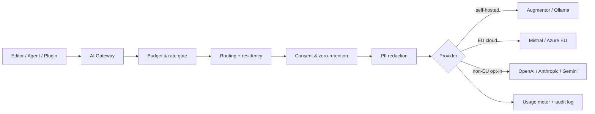

## Overview

The **AI Assistant & Provider Gateway** (`pro-ai`) is the single, governed entry point for every AI capability in Studio. Instead of each plugin wiring its own model keys, the gateway gives you **one place to configure providers, one place to enforce privacy, and one place to meter cost**.

It unifies self-hosted models (Augmentor / Ollama), EU cloud (Mistral, Azure OpenAI EU), and — opt-in — non-EU providers (OpenAI, Anthropic, Google) behind a uniform API. Routing, residency policy, fallback, redaction, consent, budgets, and an append-only audit log are applied to **every** call, no matter which feature triggered it.

<Callout kind="info">
  `pro-ai` is a **Pro plugin** on the **Team** tier. Core inference, local + EU-cloud providers, translation, writing assistance, embeddings, vision, and the Agent backbone are all Team. Two capabilities require the **Business** tier: non-EU cloud providers and advanced governance. See [Licensing &amp; Feature Gates](#licensing-and-feature-gates).
</Callout>

## Key Features

- **One gateway, many backends** — Augmentor, Ollama, Mistral, Azure OpenAI, OpenAI, Anthropic, Gemini, and any OpenAI-compatible endpoint, all behind a uniform adapter interface
- **Goal-driven routing** — per-task routes pick the right model tier, residency, and provider, with an ordered fallback chain
- **Health-based failover** — a per-provider circuit breaker skips unhealthy backends and records every fallback
- **Privacy by design** — residency modes, PII redaction before cloud egress, explicit non-EU consent, and enforced zero-retention
- **Cost control** — org/per-user token & cost budgets, per-user rate limits, license-tier ceilings, and a burn-down dashboard
- **Structured, schema-first generation** — drafts validated against your content-type JSON Schema (AJV 2020-12) with automatic re-prompting
- **In-editor assistance** — a sidebar assistant and per-field ✨ actions, every suggestion shown as an accept/reject diff
- **Shared backbone** — sibling Pro plugins (e.g. the Studio Agent) consume the same gateway via the `AI_SERVICE` contract; capabilities are also exposed as **MCP tools**
- **Full audit trail** — every call is metered and logged (privacy-preserving hashes by default)

## Architecture

Every capability flows through the same governed pipeline before a single token leaves your instance:



## Capabilities

The gateway exposes a single service surface (`AI_SERVICE`) and a REST API under `/api/v1/pro/ai/*`:

| Capability | What it does | Typical caller |
|---|---|---|
| `chat` | Streaming chat completion with optional tool-calling | Agent, editor assistant |
| `embed` / `embedBatch` | Text embeddings (single or chunked batch) | Semantic search, dedup |
| `translate` | Plain text, rich-text, or content-wide batch translation (glossary- and tone-aware) | One-click localize |
| `writeAssist` | Editor writing actions (see below) | Field actions, assistant |
| `generateStructured` | Schema-grounded drafting validated against a content type's JSON Schema | Agent, import enrichment |
| `vision` | Image → alt text, caption, OCR, tags, or description | Alt-text on upload |
| `transcribe` | Audio/video → text | Media workflows |
| `classify` | Topic/sentiment classification or entity/field extraction | Moderation, enrichment |
| `semanticSearch` / `moreLikeThis` | Rank org content by meaning against the pgvector embedding index (`moreLikeThis` is a pure index lookup — no inference) | Discovery, related content |
| `findNearDuplicates` | Advisory near-duplicate candidates (vector + lexical shingle overlap; near-verbatim copies flagged) | Editor warning, import gate |
| `moderate` | Advisory safety/PII pass — pinned to local providers by default so flagged content never leaves the instance | Publish review |
| `suggestFacets` | Facet values constrained to the content type's enumerated schema vocabulary (hallucination-proof by hard filter) | Goal-driven tagging |
| `summarizeForTeaser` | Teaser fields conforming to the type's teaser schema, honest-framing enforced, AJV-validated | Discovery teasers |

### Writing assistant actions

`writeAssist` supports eleven actions, each returning a structured result for a **diff preview** — text is never auto-applied:

`improve` · `fix` · `shorten` · `expand` · `tone` · `summarize` · `headline` · `dek` · `seo` · `social` · `continue`

List actions (`headline`, `social`) also return parsed `suggestions` so the editor can show selectable options.

### Schema-grounded generation

`generateStructured` injects the target content type's JSON Schema (and any per-type examples), generates a JSON payload, and validates it with AJV (2020-12). On invalid output, the validation errors are fed back to the model for a bounded number of retries, so callers never persist invalid content:

```json
{
  "data": { "title": "…", "summary": "…" },
  "valid": true
}
```

## For Admins: Configuration

### Migration

```bash
psql -U postgres -d roadbeat_studio -f plugins/pro-ai/migrations/001_create_ai_core.sql
psql -U postgres -d roadbeat_studio -f plugins/pro-ai/migrations/004_create_audit.sql
```

Core tables: `pro_ai_providers`, `pro_ai_models`, `pro_ai_routes`, `pro_ai_usage_log`, `pro_ai_budgets`, `pro_ai_redaction_rules`, `pro_ai_consents`, `pro_ai_prompts`, `pro_ai_jobs`, `pro_ai_log_settings`.

### Adding a provider

<Steps>
  <Step title="Open AI settings" icon="settings">
    Go to **AI** in the Pro section of the sidebar and switch to the **Providers** tab.
  </Step>
  <Step title="Choose a provider type" icon="plug">
    Pick a provider type and give it a name. The API key is stored in the **credential vault** — it is never returned to the frontend, logs, or the model.
  </Step>
  <Step title="Set residency, scope, and priority" icon="shield">
    Set the data residency, whether the key is **org-shared** or a **per-user BYO key**, and a routing priority. Mark a **no-retention** endpoint where the provider guarantees zero data retention.
  </Step>
  <Step title="Test the connection" icon="activity">
    Click **Test** to run a health check. Online providers show latency; offline ones are skipped by routing automatically.
  </Step>
</Steps>

Supported provider types and their data residency:

| Provider | Type | Residency | Default base URL |
|---|---|---|---|
| Augmentor (local AI) | `augmentor` | Self-hosted | `http://host.docker.internal:3800/v1` |
| Ollama | `ollama` | Self-hosted | `http://host.docker.internal:11434/v1` |
| Any OpenAI-compatible endpoint | `openai-compatible` | Self-hosted | _custom_ |
| Mistral | `mistral` | EU | `https://api.mistral.ai/v1` |
| Azure OpenAI (EU region) | `azure-openai` | EU | _your Azure endpoint_ |
| OpenAI | `openai` | Non-EU | `https://api.openai.com/v1` |
| Anthropic | `anthropic` | Non-EU | `https://api.anthropic.com` |
| Google Gemini | `gemini` | Non-EU | _Google endpoint_ |

<Callout kind="tip">
  A caller's **own** provider (a per-user BYO key) takes precedence over the org-shared one for the same provider type and name — so power users can bring their own keys without changing the org default.
</Callout>

### Routing and fallback

The **Routes** tab holds a per-task routing table as JSON: each task maps to a tier, residency, preferred model/provider, and an ordered fallback chain.

```json
{
  "writeAssist": { "tier": "cheap", "residency": "eu_only", "provider": "mistral" },
  "generateStructured": {
    "tier": "heavy",
    "residency": "eu_only",
    "provider": "mistral",
    "model": "mistral-large",
    "fallback": ["augmentor", "azure-openai/gpt-4o"]
  },
  "embed": { "provider": "augmentor", "model": "multilingual-e5-large" }
}
```

Routing resolves the best **healthy** provider that satisfies the residency mode, then walks the fallback chain. A per-provider circuit breaker skips backends that are failing, and every fallback is recorded in the usage log.

### Residency modes

The effective residency mode is resolved per call: a per-call override → the task route → the instance default (`AI_RESIDENCY_MODE`, default `eu_only`).

| Mode | Allowed providers |
|---|---|
| `local_only` | Self-hosted only (Augmentor / Ollama) |
| `eu_only` | Self-hosted + EU cloud |
| `any` | All providers, including non-EU (requires consent + entitlement) |

Privacy, consent, redaction, budgets, and the audit trail are documented in detail in [AI Privacy &amp; Governance](/plugins/ai-governance).

## For Editors

When `pro-ai` is active, editors get an **AI Assistant** sidebar and per-field **✨ actions** directly in the content editor — quick actions (including a local **Safety check**, **Suggest tags**, and **Draft teaser**), chat, one-click translation, and alt-text suggestions, each shown as an accept/reject diff so nothing is ever applied silently. Every result carries a **provenance badge** (Local — no egress / EU cloud / Non-EU cloud, with redaction and fallback markers), the sidebar warns about **possible duplicates** of the open item, and the first use of a non-EU provider is blocked behind an inline, logged **consent dialog**.

<Card title="Using AI in the editor" icon="sparkles" href="https://studio-docs.roadbeat.net/guides/ai-assistant" horizontal={true} cta="Open the editor guide">
  The full editor-facing walkthrough lives in the Studio documentation.
</Card>

## Licensing and Feature Gates

`pro-ai` is licensed on the **Team** tier; two capabilities require **Business**. Gates are evaluated through CE's `FeatureGateService`.

| Capability | Tier | Gate |
|---|---|---|
| Inference, local + EU-cloud providers, translation, writing, embeddings, vision, Agent backbone, per-user BYO keys | **Team** | — |
| Non-EU cloud providers (OpenAI / Anthropic / Gemini) | **Business** | `ai_cloud_providers_enabled` |
| Advanced governance (custom redaction rules, zero-retention overrides, raw-log retention controls) | **Business** | `ai_advanced_governance` |

Two numeric license limits cap org usage **on top of** admin-configured budgets, enforced in the pre-call gate (HTTP 429 on breach):

| Limit | Effect |
|---|---|
| `max_ai_tokens_per_day` | Hard daily org token ceiling |
| `max_ai_cost_per_month` | Hard monthly org cost ceiling (€) |

<Callout kind="info">
  Non-EU providers are gated at **routing** time: without `ai_cloud_providers_enabled`, EU/local providers still route normally, and a call is only refused when its *only* eligible providers are non-EU. See [Licensing](/licensing) for tiers and offline validation.
</Callout>

## Using the Gateway from Other Plugins

Sibling Pro plugins inject the gateway through the shared `AI_SERVICE` token rather than calling models directly — so they inherit routing, residency, redaction, budgets, and audit for free. This is how the **Studio Agent** (Integration Hub) plans multi-tool jobs and drafts schema-valid content, and how CE's auto-translate and alt-text hooks light up when `pro-ai` is installed.

The same capabilities are exposed as **MCP tools** (`GET /api/v1/pro/ai/mcp/tools`, `POST /api/v1/pro/ai/mcp/call`), so external AI tooling can call the governed gateway with the exact same guarantees.

<Callout kind="tip">
  When `pro-ai` is **not** installed, dependent features degrade gracefully — AI surfaces are hidden and CE auto-translate falls back to its configured machine-translation provider.
</Callout>

## API Reference

All endpoints live under `/api/v1/pro/ai` and are documented in the [Studio API Reference](https://studio-docs.roadbeat.net/api-reference/overview).

**Inference**

| Endpoint | Description |
|---|---|
| `POST /api/v1/pro/ai/chat` | Streaming chat completion (SSE; supports tool calls) |
| `POST /api/v1/pro/ai/embed` | Create embeddings |
| `POST /api/v1/pro/ai/translate` | Translate text / rich-text, or enqueue a content-wide job |
| `POST /api/v1/pro/ai/assist` | Writing assistant actions (diff preview) |
| `POST /api/v1/pro/ai/generate-structured` | Schema-grounded, validated generation |
| `POST /api/v1/pro/ai/vision` | Image → alt text / caption / OCR / tags / description |
| `POST /api/v1/pro/ai/transcribe` | Audio/video → text |
| `POST /api/v1/pro/ai/classify` | Classify (topic/sentiment) or extract entities |
| `POST /api/v1/pro/ai/jobs` | Submit a batch job (bulk translate, embed backfill) |
| `GET /api/v1/pro/ai/jobs/:id` | Get a batch job's status |

**Administration**

| Endpoint | Description |
|---|---|
| `GET /api/v1/pro/ai/providers` | List providers (secrets masked) |
| `POST /api/v1/pro/ai/providers` | Create a provider (key vaulted) |
| `PUT /api/v1/pro/ai/providers/:id` | Update a provider (rotates key if provided) |
| `DELETE /api/v1/pro/ai/providers/:id` | Delete a provider (purges vaulted key) |
| `POST /api/v1/pro/ai/providers/:id/test` | Health-check a provider |
| `GET /api/v1/pro/ai/routes` | Get the per-org routing config |
| `PUT /api/v1/pro/ai/routes` | Replace the per-org routing config |
| `GET /api/v1/pro/ai/prompts` | List prompts (org + global defaults) |
| `POST /api/v1/pro/ai/prompts` | Create a prompt (new version of key + locale) |
| `GET /api/v1/pro/ai/status` | Plugin status / health probe |
| `GET /api/v1/pro/ai/mcp/tools` | List AI capabilities exposed as MCP tools |
| `POST /api/v1/pro/ai/mcp/call` | Invoke an AI tool through the governed gateway |

Governance, usage, and budget endpoints are listed in [AI Privacy &amp; Governance](/plugins/ai-governance#api-reference).
