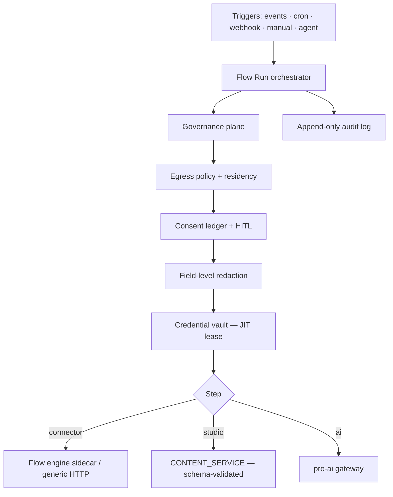
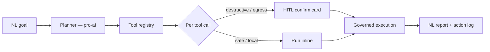

## Overview

The **Integration Hub** (`pro-integrations`) turns the headless CMS from a content store with fire-and-forget webhooks into a **goal-driven automation platform**. It ships three pillars on top of one governance plane:

1. **Connectors** — a catalog of reachable external tools (flow-engine native nodes + generic primitives + any OpenAPI/REST API + MCP servers), each with a securely **vaulted Connection**.
2. **Flows** — reusable, versioned, multi-step automations authored visually or generated from natural language, triggered by content events, schedules, inbound webhooks, manual runs, or the Agent.
3. **Studio Agent** — an AI "super agent" that plans and executes multi-tool jobs with human-in-the-loop confirmation and full schema validation.

Every connector, every byte of egress, and every autonomous action passes through a consent ledger, an encrypted credential vault, an append-only audit log, and EU-data-residency controls. The Agent works **for the publisher's goals** — never the other way around.

<Callout kind="info">
  `pro-integrations` is a **Pro plugin**. **Connectors + Flows + triggers + runs + importers** are on the **Team** tier. The **Studio Agent**, **AI flow authoring**, and **advanced governance** are **Business** and additionally require the [`pro-ai`](/plugins/ai) plugin. Multi-org **federation** is **Enterprise**. See [Licensing &amp; Feature Gates](#licensing-and-feature-gates).
</Callout>

## Key Features

- **Reach without an army** — native engine connectors, community pieces, MCP tools, an OpenAPI importer, and generic primitives (HTTP, webhook in/out, SQL, FTP, S3, email, SSH) compound into thousands of reachable endpoints
- **Encrypted credential vault** — AES-256-GCM with a per-organization data key; secrets are never returned to the frontend, never stored in the flow engine, never sent to the model, and leased just-in-time for a single call window
- **Portable, versioned Flows** — an engine-agnostic `FlowDefinition` graph compiled to the engine on activation; every change appends an immutable version
- **Six trigger types** — content events, schedules (cron), HMAC-verified inbound webhooks, manual runs, the Agent, and connector events
- **Governed run lifecycle** — egress policy + consent + redaction enforced at every external step, with HITL pauses for destructive/egress actions, retries with backoff, and a dead-letter replay
- **AI Studio Agent** — a natural-language planner over a governed tool registry, with assist/auto modes and per-call confirmation for anything destructive or egress-bound
- **European by default** — Activepieces (MIT) engine + Augmentor (local Mistral) AI, self-hostable end-to-end, with a data-residency label on every connector
- **Localized admin UI** — every surface is translated across the core EU locales (de, fr, es, it, nl, pl, pt), with English fallback for the rest

## Architecture

The Hub runs **inside** each Studio instance. The flow engine runs as an isolated sidecar on a private network so a runaway flow can never crash CE; the plugin talks to it through a thin, swappable `FlowEngineAdapter`.



<Callout kind="tip">
  **Credentials never live in the engine.** At execution time the engine asks the plugin's vault callback for a short-lived, single-use credential; OAuth tokens are refreshed first when near expiry. The engine's own credential store is disabled.
</Callout>

## Pillar 1 — Connectors

A **Connector** is a typed integration to an external system; a **Connection** is an authenticated, vaulted instance of it for one organization. Connectors expose **actions** (effectful) and **triggers** (events that start a flow). Every catalog entry carries a **maturity badge** and a **data-residency label**.

| Source | How it's reached |
|---|---|
| **Native nodes** | The self-hosted Activepieces engine's maintained connectors (Slack, Notion, HubSpot, Google Drive, Sheets, Gmail, Airtable…) |
| **Community pieces** | The engine's community ecosystem, from a security-reviewed allowlist |
| **MCP servers** | Register any MCP server (HTTP) → its tools become connector actions |
| **OpenAPI importer** | Point it at any OpenAPI 3.x spec → a typed connector with one action per operation |
| **Generic primitives** | HTTP request, outgoing/incoming webhook, SQL, FTP, S3, email, SSH (sandboxed) |

### Connections & auth

Create a Connection with **OAuth2** (authorization-code + PKCE), **API key**, or **Basic** auth. Secrets go straight to the vault; only a masked hint (`sk-…abcd`) is ever shown. OAuth connections auto-refresh before expiry and mark themselves `expired` when re-authentication is needed.

<Card title="Connector Authoring" icon="plug" href="/plugins/integrations-connectors" horizontal={true} cta="Add a connector">
  Import any OpenAPI 3.x spec, register an MCP server, or use the generic HTTP / SQL / S3 / email primitives — and vault a Connection.
</Card>

## Pillar 2 — Flows

A **Flow** is a versioned automation graph that follows the **Input → Check → Decide → Act → Report** shape, generalised to a DAG of typed steps:

| Step type | Purpose |
|---|---|
| `connector_action` | Call a connector action (egress-governed) |
| `studio` | Query / create-draft / update / publish / transition content (schema-validated) |
| `ai` | Classify / extract / summarize / translate / generate via `pro-ai` |
| `transform` | Reshape data with a template or JSONata expression |
| `condition` | Branch on an expression |
| `subflow` | Call another Flow |

The Hub stores its own **portable `FlowDefinition`** and compiles it to the engine on activation, so flows stay engine-independent and inspectable. Every save appends an immutable `pro_flow_versions` row.

### Flow Builder

A phase-laned visual canvas draws SVG connectors between step cards; a step inspector edits type-specific fields plus the step's outgoing edges (with optional `when` conditions). An **Edit JSON** escape hatch round-trips the raw graph, and a **✨ Describe** box turns a natural-language description into a draft graph for review.

<Callout kind="info">
  AI flow authoring (the **✨ Describe** box and `POST /pro/flows/generate`) is a **Business** feature and requires `pro-ai`. The generated graph is **never** auto-activated — it lands on the canvas for a human to review and save.
</Callout>

### Triggers

| Trigger | Source |
|---|---|
| **Content event** | `content.afterCreate/afterUpdate/afterPublish/afterDelete`, `asset.afterUpload`, filtered by content type |
| **Schedule** | A cron expression (evaluated in UTC) |
| **Inbound webhook** | `POST /hooks-pro/:slug` — HMAC + timestamp window + nonce de-dup |
| **Manual** | A **Run** button on the flow list, or a content-item toolbar action |
| **Connector event** | The engine's native polling/webhook triggers |
| **Agent** | The Studio Agent invokes a Flow as a tool |

### Run lifecycle

Triggers enqueue a run; a restart-safe worker drains the queue and executes each step. Per-step records persist **sha256 input/output hashes** (never raw PII) plus an egress flag and duration. Egress steps pass through the governance plane; destructive/egress steps can pause as `waiting_confirmation` until a human approves. Failed runs are the dead-letter — an admin can **retry** (with the spec-67 backoff `[1000, 5000, 30000]`), **cancel**, or **confirm** them. The full timeline is browsable on the **Runs** page.

<Card title="Flow Recipes" icon="book" href="/plugins/integrations-recipes" horizontal={true} cta="See the recipes">
  Five ready-to-adapt flows: news ingestion, CRM → Profile sync, an editorial publish guard, an agent-driven campaign, and a scheduled analytics digest.
</Card>

## Pillar 3 — Studio Agent

The **Studio Agent** translates a natural-language goal into an ordered plan of tool calls, executes them with human-in-the-loop confirmation, validates every content write against the Schema Registry, and returns a report.



- **Tool registry** — Studio ops (`studio_search`, `studio_create_draft`, `studio_update`, `studio_publish`, `studio_transition`), every active Flow as `flow:<id>`, connector actions, MCP tools, and local AI utilities — each carrying gating metadata (destructive? egress? consent class? residency).
- **Modes** — **Assist** (default) proposes a plan and confirms each effectful step; **Auto** runs internal safe steps unattended but **always** confirms egress + destructive actions, regardless of mode.
- **Safety** — content fed to the planner is tagged untrusted (the planner is told never to treat it as instructions); each action carries a replay nonce; hard per-session caps bound tool calls, iterations, and egress bytes.

Effectful execution reuses the **Flow governance path**, so egress policy, consent, credential leasing, and audit all apply to Agent actions exactly as they do to Flow steps.

<Callout kind="info">
  The Agent and AI flow authoring require the [`pro-ai`](/plugins/ai) plugin. When it is absent, Connectors and human-authored Flows keep working and the Agent surfaces are hidden (graceful degradation).
</Callout>

Governance, the credential vault, consent, audit, quotas, and multi-tenancy are covered in depth in [Integration Hub Governance](/plugins/integrations-governance).

## For Admins: Configuration

### Migrations

```bash
psql -U postgres -d roadbeat_studio -f plugins/pro-integrations/migrations/001_create_integration_core.sql
psql -U postgres -d roadbeat_studio -f plugins/pro-integrations/migrations/002_create_agent_and_governance.sql
psql -U postgres -d roadbeat_studio -f plugins/pro-integrations/migrations/003_create_vault.sql
# 004 OAuth · 005 triggers · 006 agent · 007 quotas
```

Tables (all `pro_`-prefixed, org-scoped): `pro_connectors`, `pro_connections`, `pro_flows`, `pro_flow_versions`, `pro_triggers`, `pro_flow_runs`, `pro_flow_run_steps`, `pro_agent_sessions/messages/actions`, `pro_consents`, `pro_egress_policies`, `pro_integration_audit`, `pro_vault`, `pro_vault_dek`, `pro_oauth_clients`, `pro_oauth_states`, `pro_webhook_nonces`, `pro_quota_policies`, `pro_quota_usage`.

### Required configuration

| Variable | Purpose |
|---|---|
| `INTEGRATIONS_KEK` | Key-encryption key that wraps each org's vault data key (AES-256-GCM). **Set this in production** — an insecure dev fallback is used (with a loud warning) when unset |
| `INTEGRATIONS_ENGINE_URL` | Base URL of the Activepieces sidecar (private network, no public ingress) |
| `INTEGRATIONS_ENGINE_API_KEY` | API key for the engine |
| `INTEGRATIONS_ENGINE_PROJECT_ID` | Engine project the Hub compiles flows into |

<Steps>
  <Step title="Start the flow engine sidecar" icon="server">
    Bring up Activepieces on a private docker network with no public ingress (a dev `docker-compose` is provided), and point `INTEGRATIONS_ENGINE_URL` at it.
  </Step>
  <Step title="Set the vault key" icon="key">
    Set `INTEGRATIONS_KEK` to a strong secret. Every credential is encrypted at rest with a per-org data key wrapped by this KEK.
  </Step>
  <Step title="Browse the catalog & connect" icon="plug">
    Open **Connectors**, filter by kind / residency, and click **Connect** to vault an API key or run the OAuth flow.
  </Step>
  <Step title="Author a flow" icon="workflow">
    Open **Flows → New flow**, build it on the canvas (or describe it), add a trigger, and **Activate** — activation compiles it to the engine.
  </Step>
</Steps>

## For Editors

When the Hub is active, editors get a **Run a flow** toolbar action on content items, an **Ask the Agent about this content** sidebar panel, and — where a Flow is registered as a publish guard — inline blocking with a clear reason. Everything destructive or external pauses for an explicit confirmation.

## Licensing and Feature Gates

`pro-integrations` (the whole plugin) is the **Team** entitlement. Higher-tier capabilities are gated through CE's `FeatureGateService`.

| Capability | Tier | Gate |
|---|---|---|
| Connectors, Connections + vault, visual Flows, all 6 triggers, runs, OpenAPI/MCP import | **Team** | `pro-integrations` |
| Studio Agent (assist + auto) | **Business** | `integrations_agent` (+ `pro-ai`) |
| AI flow authoring (NL → flow) | **Business** | `integrations_ai_flow_authoring` (+ `pro-ai`) |
| Advanced governance (egress-policy editing, GDPR audit export) | **Business** | `integrations_advanced_governance` |
| Multi-org federation / SSO-bound credential policies | **Enterprise** | `integrations_federation` |

Four numeric license limits cap org usage (`0` / unset = unlimited; **Team defaults** in parentheses). Count caps are enforced at create time (HTTP 403); daily ceilings are folded into the per-org quota checks as the tighter of admin policy ∧ license limit (HTTP 429):

| Limit | Effect |
|---|---|
| `max_flows` (50) | Maximum active/draft Flows per org |
| `max_connections` (25) | Maximum Connections per org |
| `max_flow_runs_per_day` (5,000) | Daily flow-run ceiling |
| `max_agent_tokens_per_day` (1,000,000) | Daily Agent token ceiling |

<Callout kind="tip">
  Gating is permissive when no license gate is bound, so the plugin behaves correctly in development. The frontend reads `GET /api/v1/pro/integrations/license` for the effective limits + tier features to gate its UI.
</Callout>

## API Reference

All endpoints live under `/api/v1`. See the [Studio API Reference](https://studio-docs.roadbeat.net/api-reference/overview) for schemas.

**Connectors & connections**

| Endpoint | Description |
|---|---|
| `GET /pro/integrations/connectors` | Browse the catalog (filter by kind / residency / query) |
| `POST /pro/integrations/connectors/import-openapi` | Create a connector from an OpenAPI 3.x spec |
| `POST /pro/integrations/connectors/mcp` | Register an MCP server as a connector |
| `GET /pro/integrations/connections` | List connections (secrets masked) |
| `POST /pro/integrations/connections` | Start OAuth / store an API-key or Basic connection |
| `DELETE /pro/integrations/connections/:id` | Revoke a connection and purge its vault entry |

**Flows & runs**

| Endpoint | Description |
|---|---|
| `GET/POST /pro/flows` | List / create flows |
| `GET/PUT /pro/flows/:id` | Get / update a flow (PUT appends a version) |
| `POST /pro/flows/:id/activate` · `/pause` | Compile-and-activate / pause a flow |
| `POST /pro/flows/:id/run` | Manual run (returns the run id) |
| `POST /pro/flows/generate` | AI: natural-language → `FlowDefinition` (Business) |
| `GET /pro/integrations/runs` · `/runs/:id` | Run history / a run with its step timeline |
| `POST /pro/integrations/runs/:id/retry` · `/cancel` · `/confirm` | Replay / cancel / resume a run |
| `POST /hooks-pro/:slug` | Public inbound-webhook trigger (HMAC-verified) |

**Studio Agent**

| Endpoint | Description |
|---|---|
| `POST /pro/agent/sessions` · `GET /pro/agent/sessions` | Open / list agent sessions |
| `POST /pro/agent/sessions/:id/messages` | Send a message — plans, runs safe tools, pauses for HITL |
| `POST /pro/agent/actions/:id/confirm` · `/deny` | Confirm (grant consent + execute) or deny a pending action |

Governance, consent, audit, and quota endpoints are listed in [Integration Hub Governance](/plugins/integrations-governance#api-reference).
